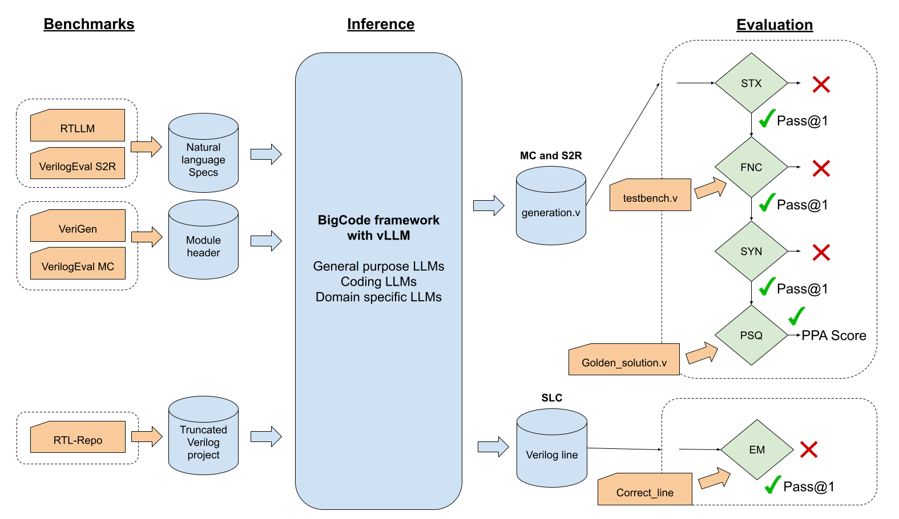

# Local/Cluster Inference with TuRTLe

This guide covers how to run TuRTLe on local GPU machines or HPC clusters using vLLM for efficient inference. If you want to use API-based inference instead, see the main [README.md](README.md).



## Table of Contents

- [HPC Environment Requirements](#hpc-environment-requirements)
- [Installation](#installation)
- [Running on HPC with SLURM](#running-on-hpc-with-slurm)

## HPC Environment Requirements

For HPC cluster execution, TuRTLe currently relies on:
- **SLURM**: Workload manager for job scheduling
- **Singularity**: Container platform for HPC environments

## Installation

### 1. Clone the repository

```bash
git clone --recursive https://github.com/HPAI-BSC/TuRTLe.git
cd TuRTLe
```

### 2. (Optional) Create and activate a virtual environment

```bash
python3 -m venv venv
source venv/bin/activate
```

### 3. Install Python dependencies

```bash
pip install -r requirements.txt
```

On non-Linux devices the above command will raise:
```
AssertionError: vLLM only supports Linux platform (including WSL).
```
In this case, vLLM has to be installed from source (see their [installation page](https://docs.vllm.ai/en/stable/getting_started/installation.html) for details).

### 4. Install bigcode-evaluation-harness as a pypi package

```bash
cd TuRTLe/bigcode-evaluation-harness/
pip install -e .
```

### 5. EDA Tools for Evaluation

For evaluation, TuRTLe uses a Docker image that includes all necessary EDA tools (OpenLane, Verilator, Icarus Verilog). You can use this Docker image directly on your HPC cluster or pull it locally:

```bash
docker pull ggcr0/turtle-eval:2.3.4
```

For more details on using Docker for evaluation, see the main [README.md](README.md#evaluate-with-docker).

## Running on HPC with SLURM

### Configuration Setup

For HPC execution with Singularity containers, you need to configure your benchmark YAML files. Each benchmark configuration file should include:

- **singularity_image**: Path to your Singularity image containing vLLM and dependencies
- **slurm_config**: Reference to a SLURM configuration in `turtle/configs/slurm.yml`

TuRTLe will automatically generate and submit SLURM job scripts based on these settings.

### SLURM Configuration

Edit `turtle/configs/slurm.yml` to match your cluster's configuration:

```yaml
general-partition:
  account: your_account
  qos: your_qos
  partition: your_partition
  time: "48:00:00"
  nodes: 1
  ntasks_per_node: 1
  cpus_per_task: 160
  gres: "gpu:4"
```

### Benchmark Configuration Example

In your benchmark YAML file (e.g., `turtle/configs/rtllm.yml`):

```yaml
benchmark:
  - task: rtllm
    rtllm_version: "2.0"
    path_temporary_files: /tmp/
    path_model: /chips-design/models/
    metric_output_path: /chips-design/bigcode/results/rtllm/
    singularity_image: /chips-design/bigcode/containers/inference_images/vllm-openai-0.8.5.sif
    evaluation_image: /chips-design/bigcode/containers/evaluation_images/icarus_latest-openlane2_verilator.sif
    generate_report: True
    simulator: "verilator"
    models:
      - name: Qwen2.5-Coder-7B-Instruct
        multinode: False
        slurm_config: general-single-node-large
        max_length_generation: 2048
        temperature: [0.2]
        top_p: 0.95
        top_k: -1
        n_samples: 5
        swap_space: 50
        continuous_batching_size: 64
        few_shot: 0
        precision: bf16
        save_generations: True
        save_metrics: True
        save_references: False
        trust_remote_code: True
```

### Running the Project

To execute benchmarks on HPC, use the `turtle/run.py` script:

```bash
python turtle/run.py [--benchmark <config_file>] [--model <model_name>] [--run_all]
```

#### Core Parameters

- `--benchmark`: Name of the .yml file in `turtle/configs/` (e.g., `rtlrepo`, `rtllm`, `verilog_eval_cc`, `verilog_eval_rtl`, `verigen`)
- `--model`: Specify a particular model to run. If not provided, all models in the configuration file will be executed
- `--run_all`: Run all benchmarks against all models

#### Pipeline Control Parameters

Due to the dual-image setup (one for inference, another for EDA tools), you can control each phase separately:

- `--generation_only`: Only perform inference
- `--evaluation_only`: Only perform evaluation (loads generations from YAML `metric_output_path`)

#### Examples

1. Run all models specified in the configuration file for the RTL-Repo benchmark:
   ```bash
   python turtle/run.py --benchmark rtlrepo
   ```

2. Test Qwen2.5-32B against VerilogEval Code Completion:
   ```bash
   python turtle/run.py --benchmark verilog_eval_cc --model Qwen2.5-32B
   ```

3. Run all benchmarks against all models:
   ```bash
   python turtle/run.py --run_all
   ```

4. Only run inference (skip evaluation):
   ```bash
   python turtle/run.py --benchmark rtllm --generation_only
   ```

5. Only run evaluation on existing generations:
   ```bash
   python turtle/run.py --benchmark rtllm --evaluation_only
   ```

## Multi-Node Inference

For large models that require multiple nodes, TuRTLe supports distributed inference with Ray. Configure your SLURM settings for multi-node jobs:

```yaml
general-multi-node:
  account: your_account
  qos: your_qos
  partition: your_partition
  time: "48:00:00"
  nodes: 4
  ntasks_per_node: 1
  cpus_per_task: 160
  gres: "gpu:4"
```

Then specify `tensor_parallel_size` and `pipeline_parallel_size` in your model configuration to distribute the model across GPUs and nodes.

---

For API-based inference and Docker evaluation (recommended for most users), see the main [README.md](README.md).
