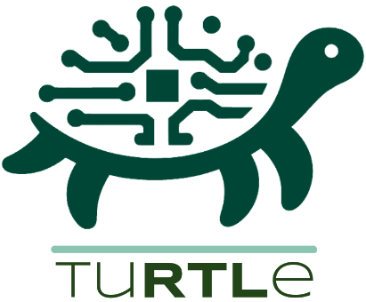

<div align="center" style="line-height: 1;">

</div>
<br/>
<div align="center" style="line-height: 1;">
  <a href="https://hpai.bsc.es/" target="_blank" style="margin: 1px;">
    
  </a>
  <a href="https://huggingface.co/HPAI-BSC" target="_blank" style="margin: 1px;">
    
  </a>
  <a href="https://github.com/HPAI-BSC" target="_blank" style="margin: 1px;">
    
  </a>
  <a href="https://arxiv.org/abs/2504.01986" target="_blank" style="margin: 1px;">
    
  </a>
  <a href="LICENSE" style="margin: 1px;">
    
  </a>
</div>
<br>

TuRTLe is a framework to assess LLMs across key RTL generation tasks systematically. It integrates multiple existing benchmarks and automates the evaluation process, enabling a comprehensive assessment of LLM performance in syntax correctness, functional correctness, synthesis, PPA optimization, and exact line completion.

<div align="center">

| **Benchmarks** | **EDA Tools** and **Metrics** |
|----------------|---------------|
| **VerilogEval v2.0** - Spec-to-RTL & Module Completion | **Icarus Verilog** and **Verilator** - STX & FNC |
| **RTLLM v1.1/v2.0** - Spec-to-RTL | **Yosys** - SYN |
| **VGen** - Module Completion | **OpenROAD** - PPA |
| **RTL-Repo** - Single Line Completion | **OpenLane** - PPA |

</div>

For more details about our work, refer to our [ArXiv paper](https://arxiv.org/abs/2504.01986).

## News

- **[2025-11-09]** We release TuRTLe v2 with API inference support and local Docker-based evaluation for easy reproducibility
- **[2025-07-03]** TuRTLe now supports Verilator as a simulator to check for Syntax and Functionality
- **[2025-06-12]** We add support for multi-node inference with Ray and the configurations for bigger models
- **[2025-05-19]** The project's source code is now publicly released. We'd love to hear your feedback, so give it a try!
- **[2025-03-31]** Our paper *"TuRTLe: A Unified Evaluation of LLMs for RTL Generation"* is now available on [ArXiv](https://arxiv.org/abs/2504.01986)!
- **[2025-03-20]** The leaderboard is now live! Check it out on our [Huggingface Space](https://huggingface.co/spaces/HPAI-BSC/TuRTLe-Leaderboard)

## Leaderboard

Check the [TuRTLe Leaderboard](https://huggingface.co/spaces/HPAI-BSC/TuRTLe-Leaderboard) to know the best open-source models for each task.

## Quick Start

> Make sure you have installed TuRTLe and its dependencies. See [Installation Guide](docs/INSTALLATION.md) for detailed setup instructions.

TuRTLe supports API-based inference which works out of the box with any OpenAI-compatible API (OpenRouter, OpenAI, Azure, etc.) with a Docker-based evaluation to run EDA tools locally.

#### Inference

```bash
$ export TURTLE_BASE_URL=https://openrouter.ai/api/v1
$ export TURTLE_API_KEY=sk-or-v1-...
$ uv run turtle/src/turtle.py --use-api \
      --model mistralai/codestral-2508 \
      --task notsotiny --shuttle tt06 \  # Can be tt06, tt07, tt08, tt09, tt10_ihp_25a, tt10_ihp_02, ttsky25a
      --temperature 0.2 \
      --max-tokens 131072 \
      --top_p 0.95 \
      --n_samples 1 \
      --save_generations \
      --save_generations_path './results/codestral-2508/nst-tt06.jsonl' \
      --generation_only
```

Available tasks: `rtllm`, `verilog_eval_rtl`, `verilog_eval_cc`, `verigen`, `rtlrepo`

#### Evaluate with Docker

Evaluate the generated RTL designs using our bundled EDA tools (OpenLane, Verilator, Icarus Verilog):

```bash
$ docker run --rm -v $(pwd):/work -w /work ggcr0/turtle-eval:2.3.4 \
        python3 turtle/src/turtle.py \
        --task notsotiny \
        --shuttle tt06 \
        --model mistralai/codestral-2508 \
        --n_samples 1 \
        --load_generations_path ./results/codestral-2508/nst-tt06.jsonl
```

This will automatically pull the Docker image with all the EDA tooling and evaluate your designs for syntax, functionality, synthesis, and PPA metrics.

## Advanced Usage

### Local/Cluster Inference

If you have access to a GPU cluster and want to run local inference with vLLM or perform multi-node inference, see [LOCAL_INFERENCE.md](LOCAL_INFERENCE.md) for detailed instructions on using SLURM and Singularity.

### Add Your Benchmark

The process to implement a benchmark is very similar to the one described by [bigcode-evaluation-harness guide](https://github.com/bigcode-project/bigcode-evaluation-harness/blob/main/docs/guide.md). Follow these steps:

1. Copy the `turtle/tasks/template/new_task.py` into `turtle/tasks/` and rename it to the name of your benchmark `<benchmark_name>.py`.
2. Complete all the TODO comments in the template file.
3. Update the `_load_new_modules()` and `_create_extended_registry()` methods within `turtle/src/utils/task_updater.py`.

## Citation

```
@inproceedings{garciagasulla2025turtleunifiedevaluationllms,
      title={TuRTLe: A Unified Evaluation of LLMs for RTL Generation}, 
      author={Dario Garcia-Gasulla and Gokcen Kestor and Emanuele Parisi and Miquel Albert\'i-Binimelis and Cristian Gutierrez and Razine Moundir Ghorab and Orlando Montenegro and Bernat Homs and Miquel Moreto},
      booktitle = {Proceedings of the 2025 ACM/IEEE International Symposium on Machine Learning for CAD},
      series = {MLCAD '25}
      year={2025},
      publisher = {Association for Computing Machinery},
      address = {New York, NY, USA},
      location = {Santa Cruz, CA, USA},
      url={https://arxiv.org/abs/2504.01986}, 
}
```

## Contact

If you have any inquiries or wish to collaborate: hpai@bsc.es

## Acknowledgments

This work was born as a fork of [bigcode-evaluation-harness](https://github.com/bigcode-project/bigcode-evaluation-harness) and [vllm-code-harness](https://github.com/iNeil77/vllm-code-harness), and has grown to its own framework for RTL code generation evaluation. We remain grateful to these projects.

We acknowledge the open-source EDA tools: [Icarus Verilog](https://github.com/steveicarus/iverilog), [Verilator](https://www.veripool.org/verilator/), [Yosys](https://github.com/YosysHQ/yosys), [OpenROAD](https://github.com/The-OpenROAD-Project/OpenROAD) and [LibreLane](https://github.com/librelane/librelane).

We also thank the authors of the benchmarks integrated in TuRTLe: [VerilogEval](https://github.com/NVlabs/verilog-eval), [RTLLM](https://github.com/hkust-zhiyao/RTLLM), [VGen](https://github.com/shailja-thakur/VGen), and [RTL-Repo](https://github.com/AUCOHL/RTL-Repo).

