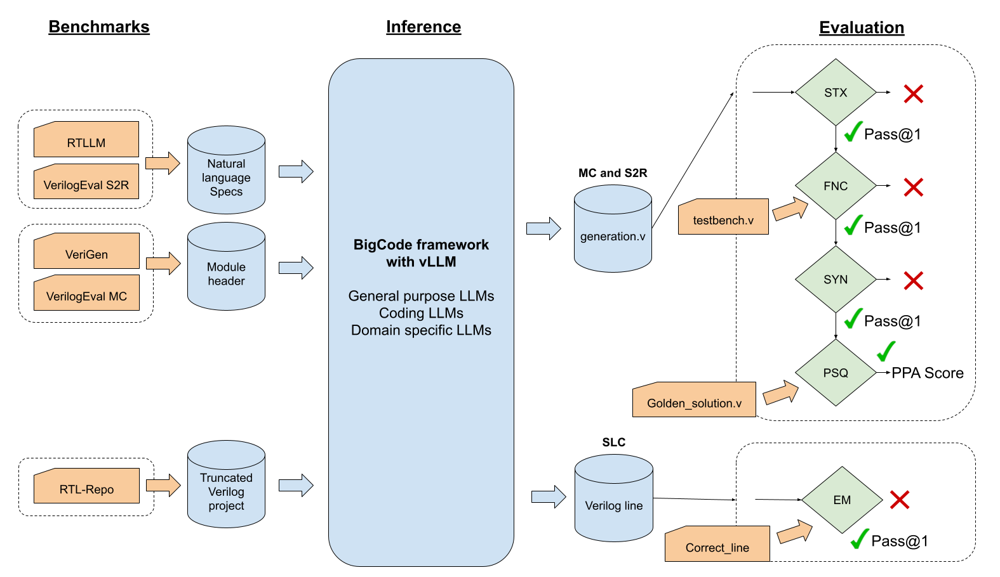
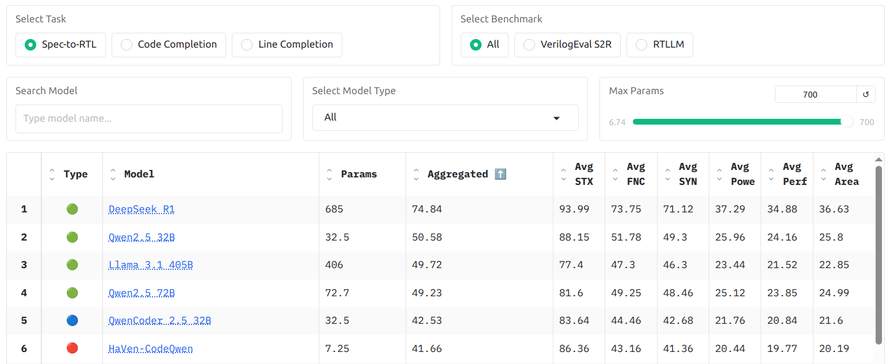

<div align="center">
  <h1 align="center">
    TuRTLe: A Unified Evaluation of LLMs for RTL Generation
  </h1>
</div>
<div align="center" style="line-height: 1;">
  <a href="https://hpai.bsc.es/" target="_blank" style="margin: 1px;">
    
  </a>
  <a href="https://huggingface.co/HPAI-BSC" target="_blank" style="margin: 1px;">
    
  </a>
  <a href="https://github.com/HPAI-BSC" target="_blank" style="margin: 1px;">
    
  </a>
  
  
</div>
<div align="center" style="line-height: 1;">
  <a href="https://www.linkedin.com/company/hpai" target="_blank" style="margin: 1px;">
    
  </a>
  <a href="https://bsky.app/profile/hpai.bsky.social" target="_blank" style="margin: 1px;">
    
  </a>
  <a href="https://linktr.ee/hpai_bsc" target="_blank" style="margin: 1px;">
    
  </a>
</div>
<div align="center" style="line-height: 1;">
  <a href="https://arxiv.org/abs/2504.01986" target="_blank" style="margin: 1px;">
    
  </a>
  <a href="LICENSE" style="margin: 1px;">
    
  </a>
</div>
<br>
<div align="center" style="line-height: 1;">

</div>
<br>

# 🐢Welcome to the **TuRTLe Project**!🐢

TuRTLe is a framework to assess LLMs across
key RTL generation tasks systematically. It integrates multiple existing benchmarks and automates the evaluation process, enabling a comprehensive assessment of LLM performance in syntax correctness,
functional correctness, synthesis, PPA optimization, and exact line
completion.

This work extends the functionality and flexibility of [bigcode-evaluation-harness](https://github.com/bigcode-project/bigcode-evaluation-harness) with the use of open-source EDA tools to run Specification-to-RTL and RTL Code Completion benchmarks. Furthermore, it is inspired from [vllm-code-harness](https://github.com/iNeil77/vllm-code-harness) to allow an efficient inference with vLLM.

Benchmarks implemented so far are:

- [VerilogEval](https://github.com/NVlabs/verilog-eval): Specification-to-RTL and Module Completion
- [RTLLM v1.1 and v2.0](https://github.com/hkust-zhiyao/RTLLM): Specification-to-RTL
- [VGen](https://github.com/shailja-thakur/VGen): Module Completion
- [RTL-Repo](https://github.com/AUCOHL/RTL-Repo): Single Line Completion

Open-source EDA tools integrated:

- [ICARUS Verilog](https://github.com/steveicarus/iverilog): syntax and functionality
- [Yosis](https://github.com/YosysHQ/yosys): synthesis
- [OpenROAD](https://github.com/The-OpenROAD-Project/OpenROAD): PPA
- [OpenLane](https://github.com/The-OpenROAD-Project/OpenLane): to integrate Yosis and OpenROAD

General overview of the framework:


# Latest News 🔥

- **[2025-05-14]** The project’s source code is now publicly released. We’d love to hear your feedback, so give it a try!
- **[2025-03-31]** Our paper *"TuRTLe: A Unified Evaluation of LLMs for RTL Generation"* is now available on [ArXiv](https://arxiv.org/abs/2504.01986)!
- **[2025-03-20]** The leaderboard is now live! Check it out on our [Huggingface Space](https://huggingface.co/spaces/HPAI-BSC/TuRTLe-Leaderboard).

# Leaderboard 🥇 

Check the [TuRTLe Leaderboard](https://huggingface.co/spaces/HPAI-BSC/TuRTLe-Leaderboard) to know the best open-source models for each task.


# Usage  

## 🛠 *Installation Steps*

Follow the steps below to set up the environment and install all dependencies:

1. **Clone the repository** (including submodules):

   ```bash
   git clone --recurse-submodules https://github.com/HPAI-BSC/TuRTLe.git
   cd your-repo-name
   ```

   > *If you've already cloned the repo without `--recurse-submodules`, run:*

   ```bash
   git submodule update --init --recursive
   ```

2. **(Optional) Create and activate a virtual environment**:

   ```bash
   python3 -m venv venv
   source venv/bin/activate
   ```

3. **Install Python dependencies**:

   ```bash
   pip install -r requirements.txt
   ```

We recommend using Singularity for containerization on HPC environments. TuRTLe can dynamically create and submit Slurm job script. To enable this, include the following settings in your benchmark configuration file:
- **singularity_image**: path to your singularity image.
- For each model, specify a **slurm_config** from `turtle/configs/slurm.yml` with the slurm directives to run the benchmark.

## 🏃‍♂️ *Running the Project*

To execute the project, use the `turtle/run.py` script with the appropriate arguments. Below are the details of the available parameters:

```bash
python turtle/run.py [--benchmark <config_file>] [--model <model_name>] [--run_all]
```

### Parameters

- `--benchmark`: Name of the .yml file in `turtle/configs/` with the configurations of the benchmark to run (e.g., `rtlrepo`, `rtllm_v2.0`, `verilog_eval_cc`, `verigen`).
- `--model`: Specify a particular model to run. If not provided, all models in the configuration file will be executed.
- `--run_all`: Use this flag to run all benchmarks against all models.

### Examples

1. Run all models specified in the configuration file for the RTL-Repo benchmark:
   ```bash
   python turtle/run.py --benchmark rtlrepo 
   ```

2. Test Qwen2.5-32B against the benchmark VerilogEval Code Completion:
   ```bash
   python turtle/run.py --benchmark verilog_eval_cc --model Qwen2.5-32B
   ```

3. Run all benchmarks against all models:
   ```bash
   python turtle/run.py --run_all
   ```

## ✨ *Add your benchmark*   

The process to implement a benchmark is very similar to the one described by [bigcode-evaluation-harness guide](https://github.com/bigcode-project/bigcode-evaluation-harness/blob/main/docs/guide.md). Follow these steps:

1. Copy the `turtle/tasks/template/new_task.py` into `turtle/tasks/` and rename it to the name of your benchmark `<benchmark_name>.py`.
3. Complete all the TODO comments in the template file.
3. Define a configuration file named `turtle/configs/<benchmark_name>.yml` and list the models you want to evaluate along with their required parameters.

# Citation 📖

```
@misc{garciagasulla2025turtleunifiedevaluationllms,
      title={TuRTLe: A Unified Evaluation of LLMs for RTL Generation}, 
      author={Dario Garcia-Gasulla and Gokcen Kestor and Emanuele Parisi and Miquel Albert\'i-Binimelis and Cristian Gutierrez and Razine Moundir Ghorab and Orlando Montenegro and Bernat Homs and Miquel Moreto},
      year={2025},
      eprint={2504.01986},
      archivePrefix={arXiv},
      primaryClass={cs.AR},
      url={https://arxiv.org/abs/2504.01986}, 
}
```

# How to contribute 🤝  

Any contribution is more than welcome! If you've found a bug or have an idea for an improvement, don't hesitate to open an issue using our [issue template](). We also encourage people to do pull requests with new benchmarks of any task relevant for chip design.

# Contact 📩

If you have any questions or feedback, feel free to email us at hpai@bsc.es. You can also support the project by following or starring the repository.

---

**Made with ❤️ by [HPAI](https://hpai.bsc.es/) at the [Barcelona Supercomputing Center (BSC)](https://www.bsc.es/)**  
